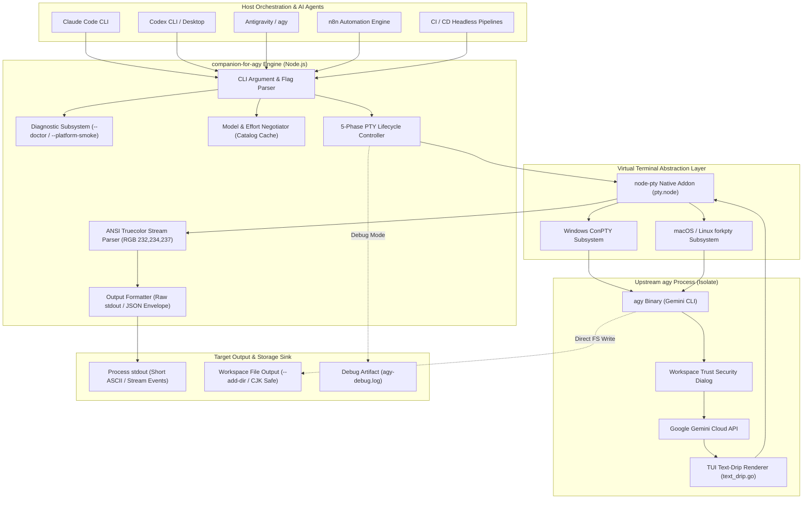
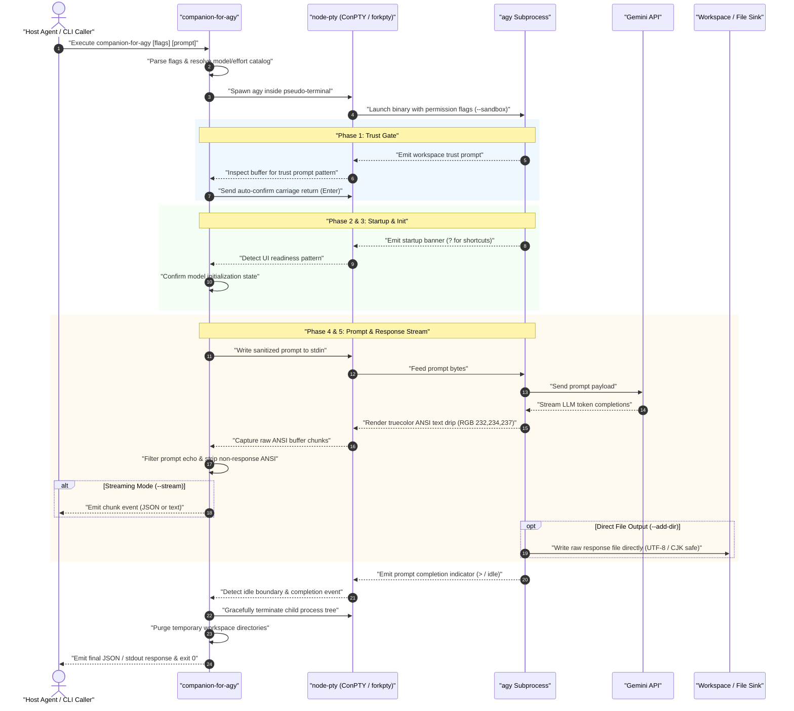

# companion-for-agy

<p align="left">
  
</p>

[](https://www.npmjs.com/package/companion-for-agy)
[](https://github.com/ellmos-ai/companion-for-agy/actions/workflows/tests.yml)
[](_tests/)
[](https://nodejs.org)
[](https://github.com/ellmos-ai/companion-for-agy)
[](https://github.com/ellmos-ai/companion-for-agy)
[](LICENSE)
[](https://github.com/dev-bricks)
[](https://github.com/ellmos-ai/companion-for-agy)
[](https://github.com/open-bricks)
[](SECURITY.md)
[](SECURITY.md)
[](SECURITY.md)
[](llms.txt)
[](README.md)
[](README_de.md)
[](README_es.md)
[](README_zh-Hans.md)
[](README_ja.md)
[](README_ru.md)

> **Unofficial** — not affiliated with or endorsed by Google.

> [!NOTE]
> **AI Agent & LLM Integration:** `companion-for-agy` is structured for automated execution by AI agents (Claude Code, Codex, Antigravity, n8n). For machine-readable context, architecture summaries, and search phrases, see [llms.txt](llms.txt).

> 🌐 **Language / Sprache**: [English](README.md) | [Deutsch](README_de.md) | [Español](README_es.md) | [简体中文](README_zh-Hans.md) | [日本語](README_ja.md) | [Русский](README_ru.md)
>
> 📍 **Quick Navigation**:
> [⚡ Quickstart](#-quickstart) •
> [🏛️ System Architecture](#️-system-architecture) •
> [🔄 Lifecycle & Sequence](#-lifecycle--execution-sequence) •
> [🎯 Problem & Value Proposition](#-problem--value-proposition) •
> [📦 Installation](#-installation) •
> [⚙️ Permission Modes](#️-permission-modes) •
> [📁 Workspace](#-workspace) •
> [🛠️ Options](#️-options) •
> [🛡️ Runtime Invariants & Safety](#️-runtime-invariants--safety-matrix) •
> [🌐 Sibling Ecosystem Matrix](#-sibling-tools--ecosystem-matrix) •
> [🛣️ Return Paths](#-best-practices-two-return-paths) •
> [🌍 Internationalization](#-internationalization-scope) •
> [🔒 Security Policy](#-security-policy--vulnerability-reporting) •
> [📄 License](#-license)

PTY-based wrapper for **agy** (Antigravity CLI / Gemini CLI) that captures Gemini responses from subprocesses.

| Start here | Link |
|---|---|
| Install | `npm install -g companion-for-agy` |
| Run | `companion-for-agy --json --sandbox "prompt"` |
| German docs | [README_de.md](README_de.md) |
| Security Policy | [SECURITY.md](SECURITY.md) |
| LLM Context | [llms.txt](llms.txt) |
| Changelog | [CHANGELOG.md](CHANGELOG.md) |
| npm package | [npmjs.com/package/companion-for-agy](https://www.npmjs.com/package/companion-for-agy) |

---

## ⚡ Quickstart

```bash
# 1. Install companion-for-agy globally
npm install -g companion-for-agy

# 2. Run a simple headless query (outputs stdout)
companion-for-agy --sandbox "Explain how node-pty works in 2 sentences."

# 3. Request structured JSON output with model specification
companion-for-agy --json --model gemini-3.5-flash "What is the capital of France?"

# 4. Run platform preflight diagnostics (auth-free)
companion-for-agy --doctor
```

---

## 🏛️ System Architecture

The following diagram illustrates how `companion-for-agy` bridges host AI coding agents, the virtual terminal layer, and the upstream `agy` CLI engine:



---

## 🔄 Lifecycle & Execution Sequence

The sequence diagram demonstrates the 5-phase execution lifecycle from invocation through PTY streaming, echo filtering, and deterministic cleanup:



---

## 🎯 Problem & Value Proposition

`agy -p` (print mode) exits with code 0 but writes no response to stdout. Instead, the TUI text-drip renderer (`text_drip.go`) writes to the terminal buffer. Known upstream issues:

- [antigravity-cli#76](https://github.com/google-antigravity/antigravity-cli/issues/76)
- [gemini-cli#27466](https://github.com/google-gemini/gemini-cli/issues/27466)
- [antigravity-cli#115](https://github.com/google-antigravity/antigravity-cli/issues/115)

That means other agents such as Claude Code, Codex, or CI/CD scripts cannot programmatically read agy's responses.

`companion-for-agy` starts agy inside a virtual terminal via `node-pty` (ConPTY on Windows, forkpty on macOS/Linux) and extracts the response from the ANSI color stream. agy's response text currently uses `RGB(232,234,237)`, so the wrapper tracks ANSI color state and collects only text in that color.

> **Platform note:** ANSI color extraction (`RGB(232,234,237)`) and the `--model` flag have been verified on **Windows** with agy >= 1.1. On **Linux**, the repository now also has a real `node-pty`/`forkpty` smoke (`npm run test:linux-pty`) that checks `spawn-helper`, the native `pty.node`, and truecolor extraction through `/bin/sh`; the remaining open Linux step is a live agy session. macOS still needs the first independent live verification.
>
> - **agy v1.0.x** (Homebrew `antigravity-cli`) does not support `--model`; use `--no-model` or `AGY_COMPANION_NO_MODEL=1`.
> - If color extraction returns an empty result, run with `--debug` and inspect `agy-debug.log`.
> - Run `companion-for-agy --doctor` before the first macOS/Linux smoke to verify agy path, `node-pty`, native binary, and POSIX `spawn-helper` readiness.
> - Run `companion-for-agy --pty-smoke` before the first live agy test. It verifies the packaged `node-pty` truecolor path without requiring agy authentication.
> - Run `companion-for-agy --platform-smoke --json` to bundle `--doctor` and `--pty-smoke` into one pre-live platform gate for macOS/Linux handoff logs.
> - Run `companion-for-agy --live-smoke --no-model --debug --json` for the first authenticated macOS/Linux live smoke. It asks agy for the marker `AGY_LIVE_SMOKE_OK`, verifies the captured response exactly, and writes raw ANSI evidence to `agy-debug.log`.
> - On Linux, run `npm run test:linux-pty` before the first live agy test. It verifies the PTY pipeline without requiring agy authentication.

---

## 📦 Installation

```bash
npm install -g companion-for-agy
```

### Prerequisites

- **Node.js >= 18**
- **agy** ([Gemini CLI](https://github.com/google-gemini/gemini-cli)) installed and authenticated
- **C/C++ build tools** for native `node-pty` compilation:
  - **Windows:** Visual Studio Build Tools + Python 3
  - **macOS:** `xcode-select --install`
  - **Linux:** `sudo apt install build-essential python3` (Debian/Ubuntu)

If native compilation fails, run:

```bash
npm rebuild node-pty
```

---

## ⚙️ Permission Modes

agy exposes exactly three native permission states; companion-for-agy passes the matching flag through unchanged. There are no soft/emulated modes and no per-invocation allow/deny rules — agy does not read workspace-local permission rules, so enforcement comes only from these flags.

| Flag | Description |
|------|-------------|
| _(default, no flag)_ | agy uses its **own** configuration (global + per-project allow/deny/ask rules under `~/.gemini/antigravity-cli/`) |
| `--sandbox` | Shell and network blocked, filesystem limited to the workspace (writing files still works) |
| `--skip-permissions` | Auto-approve every tool (YOLO), full rights. Also accepts `--dangerously-skip-permissions` |

> **Default-mode caveat:** In headless print mode a tool that is neither pre-allowed nor denied in agy's own config resolves to `ask` and blocks. Use `--skip-permissions` for tasks that need tools which are not already approved.

---

## 📁 Workspace

```bash
--add-dir "/path/to/dir"      # Add a directory to agy's workspace (repeatable)
```

agy only writes files inside its own workspace directory. Without `--add-dir`, any file-write attempt outside the temp workspace is silently ignored or reported as a success even though no file was created.

Use `--add-dir` to register additional directories so agy can actually create or modify files there:

```bash
# Write a file into /my/output — requires both workspace registration and write permission
companion-for-agy --skip-permissions --add-dir "/my/output"   "Write hello.txt to /my/output with content: Hello World"
```

> **Note:** `--skip-permissions` (YOLO mode) controls **tool authorization**; `--add-dir` controls **workspace scope**. Both are needed when writing to a directory outside the default temp workspace.

---

## 🛠️ Options

| Flag | Description |
|------|-------------|
| `--add-dir <dir>` | Add a directory to agy's workspace (repeatable); required for agy to write files outside its temp dir |
| `--model <model>` | Gemini model (default: `gemini-3.5-flash`) |
| `--effort <level>` | Explicit agy effort; validated against the discovered model catalog |
| `--no-effort` | Suppress automatic effort selection for the requested model |
| `--no-model` | Do not pass `--model` to agy; useful for agy v1.0.x |
| `--list-models` | Print the live agy model catalog (cached for 24 hours per agy path/version) |
| `--refresh-models` | Refresh the live model catalog and print it |
| `--version`, `-V` | Print the companion version |
| `--timeout <ms>` | Timeout in ms (default: `120000`) |
| `--json` | Output as JSON object |
| `--report-file <path>` | Write diagnostic report JSON to a file for `--doctor`, `--platform-smoke`, `--pty-smoke` and `--live-smoke` |
| `--debug` | Save raw PTY output to `agy-debug.log` (contains the full session incl. your prompt in clear text — do not commit) |
| `--doctor` | Print a platform preflight for agy, node-pty and helper artifacts |
| `--platform-smoke` | Run `--doctor` and `--pty-smoke` as one pre-live platform gate |
| `--pty-smoke` | Run an auth-free node-pty truecolor smoke for platform validation |
| `--live-smoke` | Run a real agy marker smoke; defaults to `sandbox` unless another permission mode is selected |
| `--probe-color` | Ask `What is 2+2?`, detect the truecolor wrapping `4`, and cache it per platform |
| `--stream` | Emit response chunks as they arrive instead of waiting for the final response |
| `--lang <code>` | CLI output language: `en`, `de`, `es`, `zh-Hans`, `ja`, `ru` |
| `--` | Stop option parsing; use before prompts that start with `-` |

### Environment Variables

| Variable | Description |
|----------|-------------|
| `AGY_COMPANION_AGY_PATH` | Path to agy binary (auto-detected if unset) |
| `AGY_PATH` | Alternative path to agy binary |
| `AGY_COMPANION_NO_MODEL` | Set to `1`, `true`, or `yes` to omit `--model` |
| `AGY_COMPANION_RESPONSE_RGB` | Override response color as `R,G,B` or `R;G;B` |
| `AGY_COMPANION_RESPONSE_RGB_CACHE` | Override the per-platform response-color cache path |

### Examples

```bash
companion-for-agy "What is the capital of Bavaria?"
companion-for-agy --sandbox "Review this code: ..."
companion-for-agy --json --model gemini-3.6-flash --effort high "prompt"
companion-for-agy --refresh-models --json
companion-for-agy --no-model "prompt"
companion-for-agy --skip-permissions --add-dir "/my/output" "Write hello.txt to /my/output"
companion-for-agy --doctor
companion-for-agy --doctor --json
companion-for-agy --platform-smoke --report-file reports/platform-smoke.json
companion-for-agy --platform-smoke --json
companion-for-agy --pty-smoke --json
companion-for-agy --live-smoke --no-model --debug --json
companion-for-agy --probe-color --no-model --json
companion-for-agy --stream --sandbox "Explain this change briefly."
companion-for-agy --lang de --help
companion-for-agy --sandbox -- "-dash-prefixed prompt"
```

For agy >= 1.1, the companion discovers the available models and their effort variants from agy's own invalid-model response. It validates explicit selections, automatically chooses a supported effort when none is supplied, and retries once before the prompt if agy reports that effort must be added or removed.

JSON output includes `response`, `model`, `requestedModel`, `effort`, `effortAutoSelected`, `availableModels`, and `permissionMode`. `model` is detected from agy's banner when possible and falls back to `requestedModel`. With `--stream --json`, chunk events are emitted as `{"type":"chunk","chunk":"..."}` and the final result as `{"type":"result",...}`.

---

## 🛡️ Runtime Invariants & Safety Matrix

The following table formalizes the 10 operational and security invariants guaranteed by `companion-for-agy`:

| # | Invariant | Enforcement Mechanism | Verification Guarantee |
|---|-----------|-----------------------|------------------------|
| 1 | **100% Local-First & Zero-Egress** | Zero external network calls in companion runtime; all sockets are local stdio | Verified by contract test in `_tests/metadata.test.mjs` (no outbound fetch/http/telemetry imports) |
| 2 | **Non-Elevation (User-Mode Only)** | No root / Administrator privileges required or requested; RunAsInvoker semantics | Fully functional in standard unprivileged user shell; prevents privilege escalation |
| 3 | **PTY Process Isolation** | Isolated subprocess spawning via `node-pty` (Windows ConPTY, macOS/Linux forkpty) | Isolates host terminal environment from child terminal escape mutations |
| 4 | **Input Sanitization** | `sanitizeForPty` strips control characters and malicious ANSI terminal escape codes | Prevents terminal injection attacks via crafted prompt inputs |
| 5 | **Deterministic Temp Workspace Cleanup** | Workspaces created under `os.tmpdir()` with restrictive modes; auto-purged on exit | No residual files left behind after command completion or timeout |
| 6 | **Native Permission Pass-Through** | Strict pass-through of native flags (`--sandbox`, `--skip-permissions`); no emulated soft modes | Zero permission spoofing; security boundaries enforced by native agy binaries |
| 7 | **ANSI Truecolor Stream Extraction** | Precise ANSI SGR regex filter targeting `RGB(232,234,237)` with adaptive cache (`--probe-color`) | Eliminates UI decoration, spinner frames, and banner noise from agent response |
| 8 | **Graceful Process Tree Termination** | Cascading SIGINT/SIGTERM handlers and timeout monitors terminate child tree | Eliminates zombie processes (`node.exe` / `agy`) on abnormal exit or abort |
| 9 | **Cross-Platform Diagnostic Preflight** | `--doctor`, `--platform-smoke`, `--pty-smoke` and `--live-smoke` health-check suite | Detects platform blockers (missing build tools, POSIX spawn-helper bit) before execution |
| 10 | **Dual Return Path Reliability** | Explicit routing: stdout for short ASCII queries, filesystem (`--add-dir`) for bulky/CJK data | Overcomes terminal buffer CJK byte-loss without silent data truncation |

---

## 🌐 Sibling Tools & Ecosystem Matrix

`companion-for-agy` is part of the **[dev-bricks](https://github.com/dev-bricks)** and **[ellmos-ai](https://github.com/ellmos-ai)** developer tooling ecosystems under the **[open-bricks](https://github.com/open-bricks)** open-source umbrella:

| Tool | Ecosystem | Focus | Link |
|---|---|---|---|
| **safe-start-for-codex** | `dev-bricks` | Startup surge prevention & resource throttling for Codex Desktop | [GitHub](https://github.com/dev-bricks/safe-start-for-codex) |
| **automizer-for-claude-desktop** | `dev-bricks` | Automations and hook orchestrator for Claude Desktop | [GitHub](https://github.com/dev-bricks/automizer-for-claude-desktop) |
| **DevCenter** | `dev-bricks` | Developer dashboard, tool health & multi-agent system orchestration | [GitHub](https://github.com/dev-bricks/DevCenter) |
| **CodeBox** | `dev-bricks` | Isolated code execution sandbox & script runner | [GitHub](https://github.com/dev-bricks/CodeBox) |
| **CareCenter-for-Codex** | `dev-bricks` | Client care documentation & clinical process assistant | [GitHub](https://github.com/dev-bricks/CareCenter-for-Codex) |
| **automation-master** | `dev-bricks` | Workflow automation engine & multi-agent scheduler | [GitHub](https://github.com/dev-bricks/automation-master) |
| **ellmos-filecommander-mcp** | `ellmos-ai` | Filesystem, shell & process orchestration MCP server | [GitHub](https://github.com/ellmos-ai/ellmos-filecommander-mcp) |
| **ellmos-codecommander-mcp** | `ellmos-ai` | Code analysis, refactoring & AST processing MCP server | [GitHub](https://github.com/ellmos-ai/ellmos-codecommander-mcp) |
| **ellmos-controlcenter-mcp** | `ellmos-ai` | MCP stack control plane, bundle routing & permission audit | [GitHub](https://github.com/ellmos-ai/ellmos-controlcenter-mcp) |
| **ellmos-clatcher-mcp** | `ellmos-ai` | Multi-agent communication bridge & cross-process clipboard | [GitHub](https://github.com/ellmos-ai/ellmos-clatcher-mcp) |
| **n8n-manager-mcp** | `ellmos-ai` | n8n workflow management, backup & activation MCP server | [GitHub](https://github.com/ellmos-ai/n8n-manager-mcp) |
| **skills** | `ellmos-ai` | Autonomous agent skills & execution library | [GitHub](https://github.com/ellmos-ai/skills) |
| **open-bricks** | `open-bricks` | Umbrella catalog for modular open-source software bricks | [GitHub](https://github.com/open-bricks) |

---

## 🛣️ Best Practices: Two Return Paths

companion-for-agy gives you two ways to get results back from agy. Choose based on what you need:

### Path 1 — stdout (short messages, task delegation)

The default path: companion-for-agy captures agy's response from the PTY and writes it to its own stdout. This works reliably for **short responses and ASCII text**, and is the right choice when you delegate a task with a brief `-p` prompt and only need a compact answer back.

```bash
companion-for-agy --sandbox "What is 2 + 2?"
```

**Limitation (observed on Windows):** When the response is long or contains non-ASCII content (e.g. CJK characters such as Chinese, Japanese, Korean), the stdout relay can garble the output — replacing characters with replacement characters (U+FFFD, e.g. `从​方阵…` becomes `从​​阵…`). This is a property of the PTY/ANSI extraction layer, not of agy itself.

### Path 2 — file output via `--add-dir` (bulky responses, non-ASCII, CJK)

Let agy write its result directly to a file. agy writes to disk itself; the data never passes through the PTY color extraction. This path is reliable for **any content**, including full CJK text.

**Pattern:** write a short instruction file, point agy at it with a brief `-p` prompt, and read the result from disk.

```bash
# agy writes the result to /my/output/result.json itself — clean UTF-8, including CJK
companion-for-agy --skip-permissions --add-dir "/my/output"   "Read /my/output/task.txt and follow it exactly."
# then read /my/output/result.json (or whatever the task specifies)
```

> **Rule of thumb:**
> - **Delegate tasks, pass short prompts** → stdout is fine.
> - **Need the full response reliably** (long text, non-ASCII, CJK) → use `--add-dir` and let agy write the file.

**Evidence:** Inbound task delivery is reliable (agy receives instructions correctly, including CJK). File output via `--add-dir` is also clean (tested on Windows with CJK content). The stdout return path is the unreliable leg for non-ASCII/bulky content.

---

## 🌍 Internationalization Scope

There are three separate i18n surfaces:

1. **companion-for-agy CLI output:** help text, errors, and status lines produced by this wrapper.
2. **Documentation:** README, contributing guide, changelog, and examples.
3. **agy TUI recognition patterns:** internal regexes that detect agy's trust dialog, startup readiness, init completion, and response completion.

Local Windows checks showed that `agy --help` stayed English under `LANG=en_US`, `de_DE`, `ja_JP`, and `zh_CN`. That suggests agy's CLI help is currently English-only, but it does not prove every TUI dialog, future agy release, plugin, or OS-specific flow will stay English.

Planned user-facing languages:

| Code | Language | Scope |
|------|----------|-------|
| `en` | English | Default CLI and canonical docs |
| `de` | German | Translated docs and CLI output |
| `es` | Spanish | Translated docs and CLI output |
| `zh-Hans` | Simplified Chinese | Translated docs and CLI output |
| `ja` | Japanese | Translated docs and CLI output |
| `ru` | Russian | Translated docs and CLI output |

Recognition patterns are not blindly translated. English stays the baseline; non-English patterns are added only when agy actually emits those strings or a stable upstream string is documented.

---

## 🔒 Security Policy & Vulnerability Reporting

`companion-for-agy` adheres to strict security and privacy standards:
- **Local-First & Zero-Egress:** Zero network egress or analytics. All data stays local.
- **Non-Elevation:** Runs exclusively in unprivileged user mode (RunAsInvoker).
- **Supported Versions:** Active security coverage for `2.1.x` and `2.0.x`.
- **Response SLAs:** 48-hour response SLA and 5-business-day formal triage commitment.
- **Reporting Channels:** Submit reports via [GitHub Security Advisories](https://github.com/ellmos-ai/companion-for-agy/security/advisories/new) or directly via email to `security@ellmos.ai` and `security@open-bricks.org`.

For full policy details, see [SECURITY.md](SECURITY.md).

---

## 📄 License

MIT © Lukas Geiger & Open-Bricks Ecosystem Contributors.\n