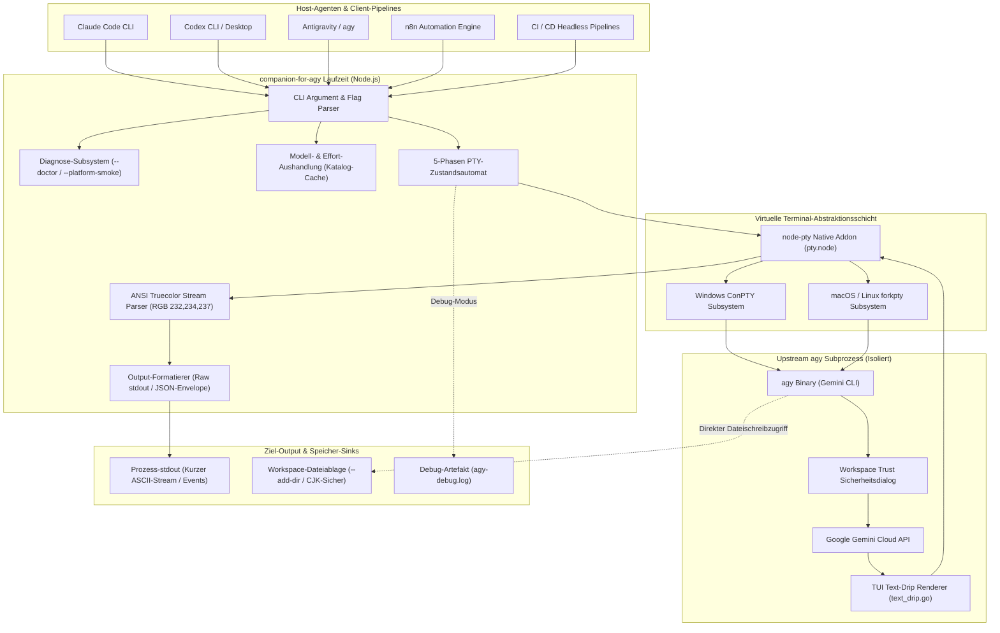
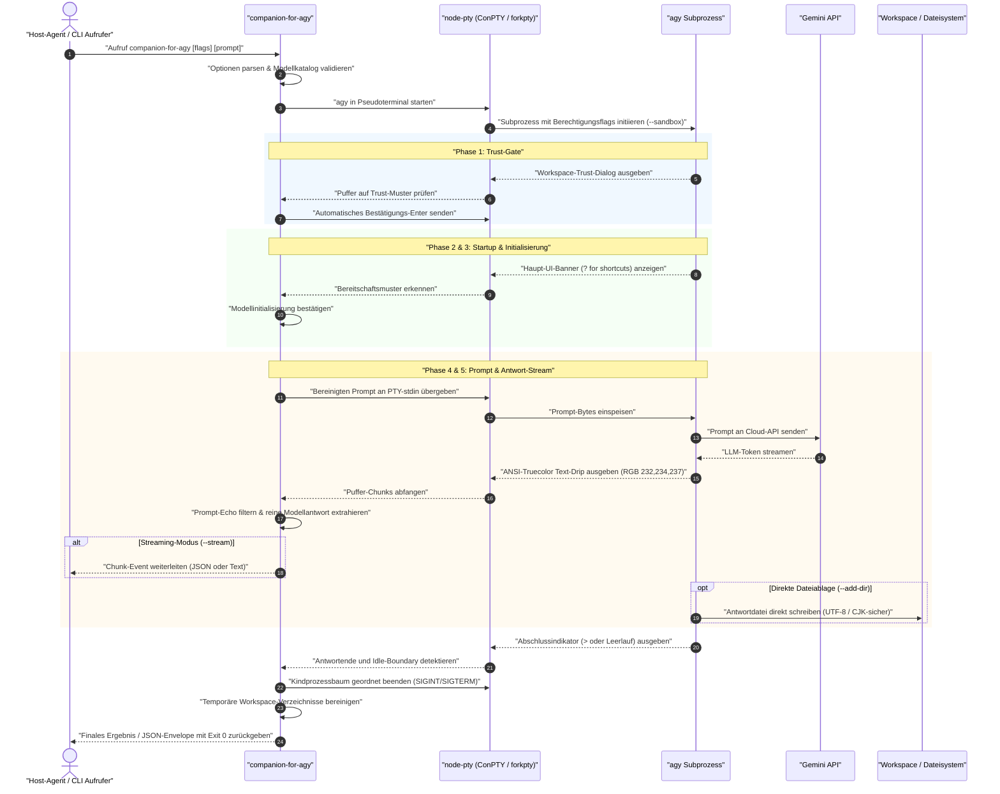

# companion-for-agy

<p align="left">
  
</p>

[](https://www.npmjs.com/package/companion-for-agy)
[](https://github.com/ellmos-ai/companion-for-agy/actions/workflows/tests.yml)
[](_tests/)
[](https://nodejs.org)
[](https://github.com/ellmos-ai/companion-for-agy)
[](https://github.com/ellmos-ai/companion-for-agy)
[](LICENSE)
[](https://github.com/dev-bricks)
[](https://github.com/ellmos-ai/companion-for-agy)
[](https://github.com/open-bricks)
[](SECURITY.md)
[](SECURITY.md)
[](SECURITY.md)
[](llms.txt)
[](README.md)
[](README_de.md)
[](README_es.md)
[](README_zh-Hans.md)
[](README_ja.md)
[](README_ru.md)

> **Inoffiziell** — nicht mit Google verbunden und nicht von Google unterstützt.

> [!NOTE]
> **KI-Agenten & LLM-Integration:** `companion-for-agy` ist für die automatisierte Ausführung durch KI-Agenten (Claude Code, Codex, Antigravity, n8n) optimiert. Maschinenlesbare Kontexte, Systemarchitekturen und Suchbegriffe befinden sich in [llms.txt](llms.txt).

> 🌐 **Language / Sprache**: [English](README.md) | [Deutsch](README_de.md) | [Español](README_es.md) | [简体中文](README_zh-Hans.md) | [日本語](README_ja.md) | [Русский](README_ru.md)
>
> 📍 **Schnellnavigation**:
> [⚡ Schnellstart](#-schnellstart) •
> [🏛️ Systemarchitektur](#️-systemarchitektur) •
> [🔄 Lebenszyklus & Sequenz](#-lebenszyklus--ausf%C3%BChrungssequenz) •
> [🎯 Problemstellung & Werteversprechen](#-problemstellung--werteversprechen) •
> [📦 Installation](#-installation) •
> [⚙️ Berechtigungsmodi](#️-berechtigungsmodi) •
> [📁 Workspace](#-workspace) •
> [🛠️ Optionen](#️-optionen) •
> [🛡️ Laufzeit-Invarianten & Sicherheitstabelle](#️-laufzeit-invarianten--sicherheitstabelle) •
> [🌐 Geschwister-Ökosystem-Matrix](#-geschwister-werkzeuge--%C3%B6kosystem-matrix) •
> [🛣️ Rückgabepfade](#-bew%C3%A4hrte-praxis-zwei-r%C3%BCckgabepfade) •
> [🌍 Internationalisierung](#-internationalisierungs-umfang) •
> [🔒 Sicherheitsrichtlinie](#-sicherheitsrichtlinie--vulnerability-reporting) •
> [📄 Lizenz](#-lizenz)

PTY-basierter Wrapper für **agy** (Antigravity CLI / Gemini CLI), der Gemini-Antworten aus Subprozessen erfasst.

| Startpunkt | Link |
|---|---|
| Installation | `npm install -g companion-for-agy` |
| Starten | `companion-for-agy --json --sandbox "prompt"` |
| Englische Doku | [README.md](README.md) |
| Sicherheitsrichtlinie | [SECURITY.md](SECURITY.md) |
| LLM-Kontext | [llms.txt](llms.txt) |
| Changelog | [CHANGELOG.md](CHANGELOG.md) |
| npm-Paket | [npmjs.com/package/companion-for-agy](https://www.npmjs.com/package/companion-for-agy) |

---

## ⚡ Schnellstart

```bash
# 1. companion-for-agy global installieren
npm install -g companion-for-agy

# 2. Einfache Headless-Abfrage ausführen (schreibt nach stdout)
companion-for-agy --sandbox "Erkläre in zwei Sätzen wie node-pty funktioniert."

# 3. Strukturierte JSON-Antwort mit Modellauswahl anfordern
companion-for-agy --json --model gemini-3.5-flash "Was ist die Hauptstadt von Frankreich?"

# 4. Plattform-Preflight-Diagnose ausführen (ohne Authentifizierung)
companion-for-agy --doctor
```

---

## 🏛️ Systemarchitektur

Das folgende Diagramm visualisiert die Integration von `companion-for-agy` zwischen übergeordneten KI-Agenten, der virtuellen Terminalschicht und dem Upstream-CLI-Prozess `agy`:



---

## 🔄 Lebenszyklus & Ausführungssequenz

Das Sequenzdiagramm dokumentiert den 5-Phasen-Lebenszyklus von der CLI-Initialisierung über das PTY-Streaming bis zur geordneten Ressourcenfreigabe:



---

## 🎯 Problemstellung & Werteversprechen

`agy -p` (Print-Modus) beendet sich mit Exit-Code 0, schreibt aber keine Antwort nach stdout. Stattdessen schreibt der TUI-Renderer (`text_drip.go`) in den Terminal-Puffer. Bekannte Upstream-Issues:

- [antigravity-cli#76](https://github.com/google-antigravity/antigravity-cli/issues/76)
- [gemini-cli#27466](https://github.com/google-gemini/gemini-cli/issues/27466)
- [antigravity-cli#115](https://github.com/google-antigravity/antigravity-cli/issues/115)

Dadurch können andere Agenten wie Claude Code, Codex oder CI/CD-Skripte agys Antworten nicht programmatisch lesen.

`companion-for-agy` startet agy in einem virtuellen Terminal via `node-pty` (ConPTY unter Windows, forkpty unter macOS/Linux) und extrahiert die Antwort aus dem ANSI-Farbstream. agys Antworttext nutzt derzeit `RGB(232,234,237)`, daher verfolgt der Wrapper den ANSI-Farbstatus und sammelt nur Text in dieser Farbe.

> **Plattformhinweis:** ANSI-Farbextraktion (`RGB(232,234,237)`) und das Flag `--model` wurden unter **Windows** mit agy >= 1.1 verifiziert. Unter **Linux** hat das Repository inzwischen auch einen echten `node-pty`-/`forkpty`-Smoke (`npm run test:linux-pty`), der `spawn-helper`, das native `pty.node` und Truecolor-Extraktion über `/bin/sh` prüft; der verbleibende offene Linux-Schritt ist eine echte agy-Live-Session. macOS benötigt weiterhin die erste unabhängige Live-Verifikation.
>
> - **agy v1.0.x** (Homebrew `antigravity-cli`) unterstützt `--model` nicht; nutze `--no-model` oder `AGY_COMPANION_NO_MODEL=1`.
> - Falls die Farbextraktion leer bleibt, mit `--debug` starten und `agy-debug.log` prüfen.
> - Vor dem ersten macOS-/Linux-Smoke `companion-for-agy --doctor` ausführen, um agy-Pfad, `node-pty`, natives Binary und POSIX-`spawn-helper`-Bereitschaft zu prüfen.
> - Vor dem ersten echten agy-Test `companion-for-agy --pty-smoke` ausführen. Der Modus prüft den paketierten `node-pty`-Truecolor-Pfad ohne agy-Authentifizierung.
> - `companion-for-agy --platform-smoke --json` ausführen, um `--doctor` und `--pty-smoke` als gemeinsames Pre-Live-Plattform-Gate für macOS-/Linux-Übergabelogs zu bündeln.
> - Für den ersten authentifizierten macOS-/Linux-Live-Smoke `companion-for-agy --live-smoke --no-model --debug --json` ausführen. Der Modus fragt agy nach dem Marker `AGY_LIVE_SMOKE_OK`, prüft die exakt gecapturete Antwort und schreibt rohe ANSI-Evidenz nach `agy-debug.log`.
> - Unter Linux vor dem ersten echten agy-Test `npm run test:linux-pty` ausführen. Der Test prüft die PTY-Pipeline ohne agy-Authentifizierung.

---

## 📦 Installation

```bash
npm install -g companion-for-agy
```

### Voraussetzungen

- **Node.js >= 18**
- **agy** ([Gemini CLI](https://github.com/google-gemini/gemini-cli)) installiert und authentifiziert
- **C/C++ Build-Tools** für die native `node-pty`-Kompilierung:
  - **Windows:** Visual Studio Build Tools + Python 3
  - **macOS:** `xcode-select --install`
  - **Linux:** `sudo apt install build-essential python3` (Debian/Ubuntu)

Falls die native Kompilierung fehlschlägt:

```bash
npm rebuild node-pty
```

---

## ⚙️ Berechtigungsmodi

agy bietet exakt drei native Berechtigungszustände; companion-for-agy reicht das passende Flag unverändert durch. Es gibt keine emulierten Soft-Modi und keine lokalen Allow/Deny-Regeln pro Aufruf — agy liest keine workspace-lokalen Regeln, daher greift die Durchsetzung ausschließlich über diese Flags.

| Flag | Beschreibung |
|------|-------------|
| _(Standard, kein Flag)_ | agy nutzt seine **eigene** Konfiguration (globale und projektbezogene Allow/Deny/Ask-Regeln unter `~/.gemini/antigravity-cli/`) |
| `--sandbox` | Shell und Netzwerk blockiert, Dateisystem auf den Workspace beschränkt (Dateien schreiben funktioniert weiterhin) |
| `--skip-permissions` | Jedes Tool automatisch bestätigen (YOLO), volle Rechte. Akzeptiert auch `--dangerously-skip-permissions` |

> **Hinweis zum Standardmodus:** Im Headless-Print-Modus blockiert ein Tool, das in agys eigener Konfiguration weder erlaubt noch verboten ist, mit einer Nachfrage (`ask`). Nutze `--skip-permissions` für Aufgaben, die nicht vorab genehmigte Werkzeuge benötigen.

---

## 📁 Workspace

```bash
--add-dir "/pfad/zum/ordner"      # Ordner zum agy-Workspace hinzufügen (wiederholbar)
```

agy schreibt Dateien ausschließlich im eigenen Workspace-Verzeichnis. Ohne `--add-dir` wird jeder Schreibversuch außerhalb des temporären Workspace still ignoriert oder als Erfolg gemeldet, obwohl keine Datei angelegt wurde.

Nutze `--add-dir`, um zusätzliche Verzeichnisse zu registrieren, damit agy dort Dateien erstellen oder verändern kann:

```bash
# Datei nach /mein/ausgabeordner schreiben — erfordert Workspace-Registrierung und Schreibberechtigung
companion-for-agy --skip-permissions --add-dir "/mein/ausgabeordner"   "Schreibe hallo.txt nach /mein/ausgabeordner mit dem Inhalt: Hallo Welt"
```

> **Hinweis:** `--skip-permissions` steuert die **Werkzeug-Autorisierung**; `--add-dir` steuert den **Workspace-Umfang**. Beide werden benötigt, um außerhalb des temporären Workspace zu schreiben.

---

## 🛠️ Optionen

| Flag | Beschreibung |
|------|-------------|
| `--add-dir <pfad>` | Ordner zum Workspace hinzufügen (wiederholbar); zwingend erforderlich, damit agy außerhalb des Temp-Ordners schreibt |
| `--model <modell>` | Gemini-Modell (Standard: `gemini-3.5-flash`) |
| `--effort <level>` | Expliziter agy-Reasoning-Aufwand; wird gegen den erkannten Modellkatalog validiert |
| `--no-effort` | Automatische Aufwandsauswahl für das angeforderte Modell unterdrücken |
| `--no-model` | Kein `--model` an agy übergeben; nützlich für agy v1.0.x |
| `--list-models` | Den Live-Modellkatalog von agy ausgeben (für 24 Stunden pro agy-Pfad/Version gecacht) |
| `--refresh-models` | Den Live-Modellkatalog aktualisieren und ausgeben |
| `--version`, `-V` | Version des Companions ausgeben |
| `--timeout <ms>` | Timeout in Millisekunden (Standard: `120000`) |
| `--json` | Ausgabe als JSON-Objekt formatieren |
| `--report-file <pfad>` | Diagnosebericht als JSON in eine Datei schreiben für `--doctor`, `--platform-smoke`, `--pty-smoke` und `--live-smoke` |
| `--debug` | Rohe PTY-Ausgabe in `agy-debug.log` speichern (enthält die gesamte Sitzung inkl. Prompt im Klartext — nicht committen) |
| `--doctor` | Plattform-Preflight für agy, node-pty und Helper-Dateien ausgeben |
| `--platform-smoke` | `--doctor` und `--pty-smoke` als gemeinsames Pre-Live-Gate ausführen |
| `--pty-smoke` | Authentifizierungsfreien node-pty Truecolor-Smoke zur Plattformprüfung ausführen |
| `--live-smoke` | Authentifizierten agy-Marker-Smoke ausführen; nutzt standardmäßig `sandbox` |
| `--probe-color` | Mit `What is 2+2?` den Truecolor-Farbwert für `4` ermitteln und plattformspezifisch cachen |
| `--stream` | Antwort-Chunks progressiv ausgeben statt auf das Gesamtresultat zu warten |
| `--lang <code\>` | CLI-Ausgabesprache: `en`, `de`, `es`, `zh-Hans`, `ja`, `ru` |
| `--` | Options-Parsing beenden; vor Prompts nutzen, die mit `-` beginnen |

### Umgebungsvariablen

| Variable | Beschreibung |
|----------|-------------|
| `AGY_COMPANION_AGY_PATH` | Pfad zum agy-Binary (wird automatisch erkannt, falls nicht gesetzt) |
| `AGY_PATH` | Alternativer Pfad zum agy-Binary |
| `AGY_COMPANION_NO_MODEL` | Auf `1`, `true` oder `yes` setzen, um `--model` wegzulassen |
| `AGY_COMPANION_RESPONSE_RGB` | Antwortfarbe als `R,G,B` oder `R;G;B` überschreiben |
| `AGY_COMPANION_RESPONSE_RGB_CACHE` | Pfad des plattformspezifischen Farbcaches überschreiben |

### Beispiele

```bash
companion-for-agy "Was ist die Hauptstadt von Bayern?"
companion-for-agy --sandbox "Prüfe diesen Code: ..."
companion-for-agy --json --model gemini-3.6-flash --effort high "prompt"
companion-for-agy --refresh-models --json
companion-for-agy --no-model "prompt"
companion-for-agy --skip-permissions --add-dir "/mein/output" "Schreibe hallo.txt nach /mein/output"
companion-for-agy --doctor
companion-for-agy --doctor --json
companion-for-agy --platform-smoke --report-file reports/platform-smoke.json
companion-for-agy --platform-smoke --json
companion-for-agy --pty-smoke --json
companion-for-agy --live-smoke --no-model --debug --json
companion-for-agy --probe-color --no-model --json
companion-for-agy --stream --sandbox "Erkläre diese Änderung kurz."
companion-for-agy --lang de --help
companion-for-agy --sandbox -- "-prompt-mit-bindestrich"
```

---

## 🛡️ Laufzeit-Invarianten & Sicherheitstabelle

Die folgende Tabelle formalisiert die 10 operativen und architektonischen Sicherheitsgarantien von `companion-for-agy`:

| # | Invariante | Durchsetzungs-Mechanismus | Verifikations-Garantie |
|---|------------|---------------------------|------------------------|
| 1 | **100% Local-First & Zero-Egress** | Keine externen Netzwerkaufrufe in der Companion-Laufzeit; alle Sockets sind lokale stdio | Vertragstest in `_tests/metadata.test.mjs` verifiziert Abwesenheit von fetch/http/Telemetrie |
| 2 | **Benutzer-Modus (Non-Elevation)** | Keine Administrator- oder Root-Rechte erforderlich; RunAsInvoker-Prinzip | Voll funktionsfähig im unprivilegierten Standard-Benutzerkontext; verhindert Rechteausweitung |
| 3 | **PTY-Prozess-Isolation** | Isolierter Subprozessstart via `node-pty` (Windows ConPTY, macOS/Linux forkpty) | Isoliert das Host-Terminal vor Escapesequenzen und Pufferänderungen des Kindprozesses |
| 4 | **Eingabe-Sanitierung** | `sanitizeForPty` filtert Steuerzeichen und schädliche ANSI-Terminalsequenzen | Schutz gegen Terminal-Injection-Angriffe durch manipulierte Prompts |
| 5 | **Deterministische Workspace-Bereinigung** | Temporäre Arbeitsverzeichnisse unter `os.tmpdir()` mit restriktiven Rechten; deterministisches Löschen | Keine Datenreste nach Abschluss oder Timeouts |
| 6 | **Native Berechtigungsweitergabe** | Strikte Weitergabe nativer Flags (`--sandbox`, `--skip-permissions`); keine emulierten Soft-Modi | Keine Berechtigungstäuschung; Sicherheitsgrenzen werden vom nativen agy-Binary durchgesetzt |
| 7 | **ANSI-Truecolor-Stream-Extraktion** | Präziser ANSI-SGR-Filter auf `RGB(232,234,237)` mit adaptivem Cache (`--probe-color`) | Filtert TUI-Dekorationen, Spinner und Banner sauber heraus |
| 8 | **Geordnete Prozessbaum-Terminierung** | Kaskadierende Signal-Handler (SIGINT/SIGTERM) und Timeout-Wächter beenden den Prozessbaum | Verhindert Zombie-Prozesse (`node.exe` / `agy`) bei Programmabbruch |
| 9 | **Plattformübergreifende Diagnose-Preflights** | Diagnose-Suite mit `--doctor`, `--platform-smoke`, `--pty-smoke` und `--live-smoke` | Erkennt Plattform-Blocker (fehlende Build-Tools, POSIX spawn-helper Bit) vor dem Start |
| 10 | **Zwei-Rückgabepfade-Zuverlässigkeit** | Explizites Routing: stdout für kurze ASCII-Abfragen, Dateisystem (`--add-dir`) für große Daten/CJK | Verhindert CJK-Zeichenverlust im Terminal-Puffer ohne stillen Datenverlust |

---

## 🌐 Geschwister-Werkzeuge & Ökosystem-Matrix

`companion-for-agy` ist Teil der Entwicklerwerkzeug-Ökosysteme von **[dev-bricks](https://github.com/dev-bricks)** und **[ellmos-ai](https://github.com/ellmos-ai)** unter dem Dachverband von **[open-bricks](https://github.com/open-bricks)**:

| Werkzeug | Ökosystem | Schwerpunkt | Link |
|---|---|---|---|
| **safe-start-for-codex** | `dev-bricks` | Anlauflast-Prävention & Ressourcen-Drosselung für Codex Desktop | [GitHub](https://github.com/dev-bricks/safe-start-for-codex) |
| **automizer-for-claude-desktop** | `dev-bricks` | Automationen und Hook-Orchestrierer für Claude Desktop | [GitHub](https://github.com/dev-bricks/automizer-for-claude-desktop) |
| **DevCenter** | `dev-bricks` | Entwickler-Dashboard, Tool-Health & Multi-Agenten-Orchestrierung | [GitHub](https://github.com/dev-bricks/DevCenter) |
| **CodeBox** | `dev-bricks` | Isolierte Code-Ausführungs-Sandbox & Skript-Runner | [GitHub](https://github.com/dev-bricks/CodeBox) |
| **CareCenter-for-Codex** | `dev-bricks` | Klientendokumentation & klinischer Prozess-Assistent | [GitHub](https://github.com/dev-bricks/CareCenter-for-Codex) |
| **automation-master** | `dev-bricks` | Workflow-Automations-Engine & Multi-Agenten-Scheduler | [GitHub](https://github.com/dev-bricks/automation-master) |
| **ellmos-filecommander-mcp** | `ellmos-ai` | Dateisystem-, Shell- & Prozess-Orchestrierungs-MCP-Server | [GitHub](https://github.com/ellmos-ai/ellmos-filecommander-mcp) |
| **ellmos-codecommander-mcp** | `ellmos-ai` | Code-Analyse-, Refactoring- & AST-Verarbeitungs-MCP-Server | [GitHub](https://github.com/ellmos-ai/ellmos-codecommander-mcp) |
| **ellmos-controlcenter-mcp** | `ellmos-ai` | MCP-Stack-Steuerungsebene, Bundle-Routing & Berechtigungs-Audit | [GitHub](https://github.com/ellmos-ai/ellmos-controlcenter-mcp) |
| **ellmos-clatcher-mcp** | `ellmos-ai` | Multi-Agenten-Kommunikationsbrücke & prozessübergreifende Zwischenablage | [GitHub](https://github.com/ellmos-ai/ellmos-clatcher-mcp) |
| **n8n-manager-mcp** | `ellmos-ai` | n8n-Workflow-Verwaltungs-, Backup- & Aktivierungs-MCP-Server | [GitHub](https://github.com/ellmos-ai/n8n-manager-mcp) |
| **skills** | `ellmos-ai` | Autonome Agenten-Skills & Ausführungsbibliothek | [GitHub](https://github.com/ellmos-ai/skills) |
| **open-bricks** | `open-bricks` | Dachkatalog für modulare Open-Source-Software-Bausteine | [GitHub](https://github.com/open-bricks) |

---

## 🛣️ Bewährte Praxis: Zwei Rückgabepfade

companion-for-agy bietet zwei Wege, Ergebnisse von agy zu empfangen:

### Pfad 1 — stdout (kurze Antworten, Aufgaben-Delegation)

Der Standardweg: companion-for-agy fängt agys Antwort aus dem PTY ab und leitet sie an das eigene stdout weiter. Das funktioniert zuverlässig für **kurze Antworten und reinen ASCII-Text** und eignet sich ideal, wenn eine Teilaufgabe mit einem knappen Prompt delegiert wird.

```bash
companion-for-agy --sandbox "Was ist 2 + 2?"
```

**Einschränkung (unter Windows beobachtet):** Bei langen Antworten oder nicht-ASCII-Inhalten (z. B. CJK-Zeichen wie Chinesisch, Japanisch, Koreanisch) kann das stdout-Relay Zeichen durch Ersetzungszeichen (`U+FFFD`) beschädigen. Dies ist eine Eigenheit der PTY/ANSI-Extraktionsschicht, nicht von agy selbst.

### Pfad 2 — Dateiausgabe via `--add-dir` (umfangreiche Antworten, CJK)

Lass agy das Ergebnis direkt in eine Datei schreiben. agy speichert die Datei selbst; die Daten passieren nicht die PTY-Farbextraktion. Dieser Pfad arbeitet für **beliebige Inhalte und vollständigen CJK-Text** absolut verlustfrei.

```bash
# agy schreibt das Ergebnis sauber als UTF-8 direkt nach /mein/output/result.json
companion-for-agy --skip-permissions --add-dir "/mein/output"   "Lies /mein/output/aufgabe.txt und befolge die Anweisungen exakt."
# anschließend /mein/output/result.json einlesen
```

> **Faustregel:**
> - **Aufgaben delegieren, kurze Prompts** → stdout reicht völlig aus.
> - **Gesamte Antwort zuverlässig benötigt** (langer Text, CJK) → `--add-dir` nutzen und agy die Datei schreiben lassen.

---

## 🌍 Internationalisierungs-Umfang

Es existieren drei getrennte Lokalisierungsebenen:
1. **companion-for-agy CLI-Ausgabe:** Hilfetexte, Fehler- und Statusmeldungen des Wrappers.
2. **Dokumentation:** README, Contributing-Guide, Changelog und Beispiele.
3. **agy TUI-Erkennungsmuster:** Interne reguläre Ausdrücke zur Erkennung von Trust-Dialogen, Startup-Readiness und Fertigstellung.

---

## 🔒 Sicherheitsrichtlinie & Vulnerability Reporting

`companion-for-agy` verpflichtet sich zu höchsten Sicherheitsstandards:
- **Local-First & Zero-Egress:** Keine Telemetrie, keine Cloud-Zwischenspeicherung.
- **Benutzermodus (Non-Elevation):** Läuft strikt ohne Administratorprivilegien.
- **Unterstützte Versionen:** Aktive Sicherheitsunterstützung für `2.1.x` und `2.0.x`.
- **Reaktions-SLAs:** 48-Stunden Reaktionszeit und 5-Werktage Triage-Zusage.
- **Meldewege:** Meldung über [GitHub Security Advisories](https://github.com/ellmos-ai/companion-for-agy/security/advisories/new) oder vertraulich per E-Mail an `security@ellmos.ai` sowie `security@open-bricks.org`.

Vollständige Details finden sich in [SECURITY.md](SECURITY.md).

---

## 📄 Lizenz

MIT © Lukas Geiger & Open-Bricks Ecosystem Mitwirkende.\n